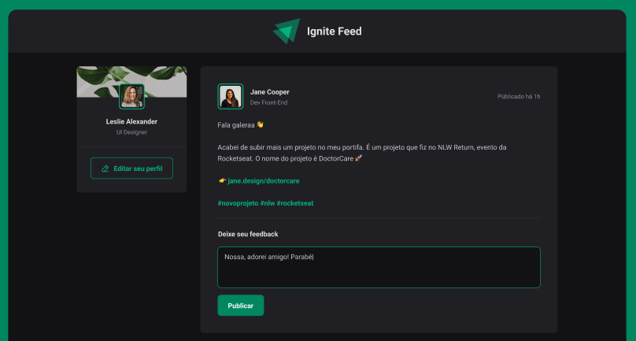

# <h1 align="center"> Ignite Feed </h1>

 Aplicação desenvolvida por mim durante o primeiro módulo de ReactJs (Fundamentos) do Ignite da Rocketseat.   Essa aplicação consiste em um feed de postagens onde o usuário poderá comentar nos posts e curtir os outros comentários 

  

## Stack utilizada

- ReactJS (Vite)
- Css Modules
- Typescript

## Referência

- [Rocketseat](https://app.rocketseat.com.br/)
